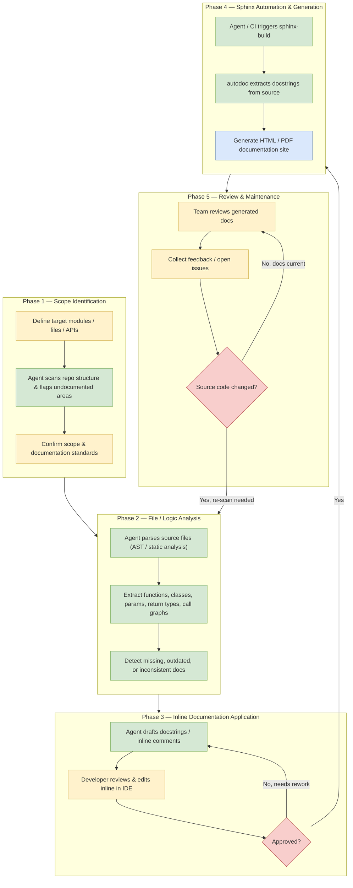

# Documentation Workflow

End-to-end workflow for producing and maintaining code documentation, showing
where the documentation agent acts autonomously versus where a human
developer/reviewer is required.

## Diagram



**Legend:** 🟩 green = documentation agent action · 🟨 yellow = human action ·
🟥 red diamond = decision point · 🟦 blue = generated output.

## Phase notes

### 1. Scope identification
- A developer/tech lead defines which modules, files, or public APIs need
  documentation coverage for the current cycle.
- **Agent involvement:** scans the repository structure (e.g. via
  [main.py](../main.py), [api.py](../api.py), [database.py](../database.py),
  [models.py](../models.py), [ui.py](../ui.py)) and flags files or symbols
  that currently lack docstrings, then proposes the scope back to the human
  for confirmation.
- Output: an agreed list of target files/symbols and the documentation style
  to follow (e.g. Google/NumPy docstring format).

### 2. File/logic analysis
- **Agent involvement:** fully agent-driven. The agent statically parses
  each in-scope file, builds an understanding of function signatures, class
  hierarchies, parameter/return types, exceptions raised, and call
  relationships, then diffs this against any existing documentation to find
  gaps or stale descriptions.
- Output: a structured analysis (per-symbol findings) feeding phase 3.

### 3. Inline documentation application
- **Agent involvement:** drafts docstrings/comments directly in the source
  files based on the phase 2 analysis.
- A human developer reviews the proposed inline documentation in the IDE,
  edits for accuracy/tone, and approves or sends it back for rework
  (feedback loop to step C1).
- Output: source files updated with accurate inline documentation.

### 4. Sphinx automation and generation
- **Agent involvement:** triggers the Sphinx build (locally or in CI),
  relying on the `autodoc` extension to pull the docstrings written in
  phase 3 directly from source.
- Output: generated HTML/PDF documentation site, published as a build
  artifact.

### 5. Review and maintenance
- The team reviews the generated documentation site for correctness and
  completeness, and logs feedback or issues.
- A maintenance check determines whether the underlying source code has
  changed since the last cycle; if so, the workflow loops back to phase 2
  (re-analysis) to keep docs in sync, otherwise documentation is considered
  current until the next change.

## Files
- Diagram source (editable): this file — the fenced ` ```mermaid ` block can
  be edited directly and re-rendered by any Mermaid-compatible viewer (VS
  Code Markdown Preview with Mermaid support, mermaid.live, or `mmdc`
  CLI/mermaid-cli to export PNG/PDF).
